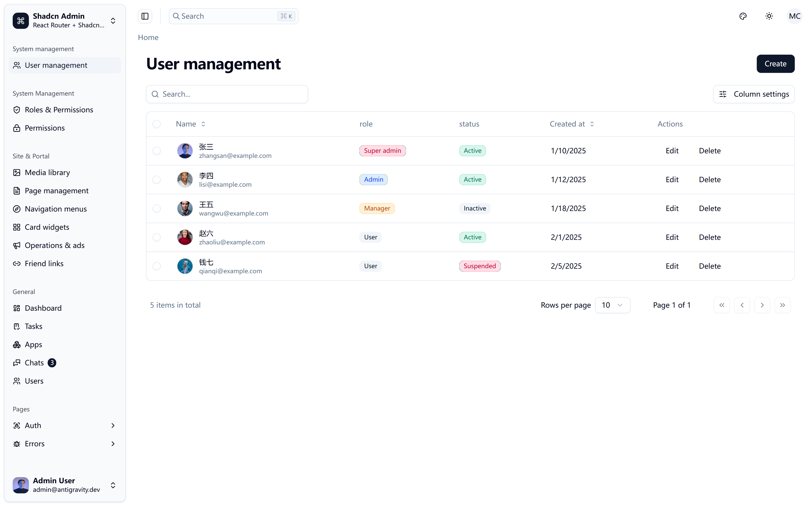
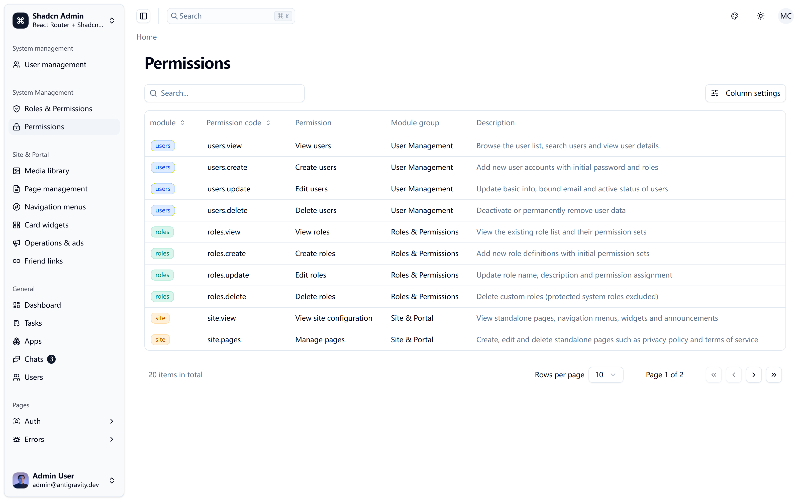

# ReactRouterAdmin

An admin foundation for React Router (framework mode), rebuilt around a declarative **Resource Engine** — define a resource once and get list, search, create, edit and delete pages with i18n, permissions and theming wired in.



## Highlights

- **Resource Engine** — declarative `defineResource` with column / field / action builders; list, create and edit pages are generated per resource
- **DataTable** — global search, column settings, row and bulk actions out of the box
- **Permission system** — grouped permission registry, `Can` guard component, and a role permission matrix for editing every granted permission
- **Media library** — categories, native previews (image / video / audio / PDF), multi-format URL copy
- **Site management** — pages, navigation, widgets, announcements and links
- **i18n** — i18next with strict key typing (English locale included)
- **Dark mode** and a responsive admin shell



## Architecture

Three layers keep resources decoupled from the backend:

```text
app/resources/*        defineResource({ columns, fields, actions })
        │
app/resource-engine    generated list / create / edit pages, builders, splat routing
        │
ResourceDataProvider   list / find / create / update / delete contract
        │
localStorage (dev) · REST · Goravel …  — swap without touching resources
```

A resource only declares _what_ it shows and edits; the engine handles _how_. All data access goes through a single `ResourceDataProvider` interface, so the same resource definitions run against any backend that implements the contract.

## Tech stack

- [React Router 8](https://reactrouter.com) (framework mode) + React 19
- [Vite 7](https://vite.dev) + [Tailwind CSS v4](https://tailwindcss.com)
- [shadcn/ui](https://ui.shadcn.com) components on Radix primitives
- [TanStack Table](https://tanstack.com/table) + [TanStack Query](https://tanstack.com/query)
- [react-hook-form](https://react-hook-form.com) + [Zod](https://zod.dev)
- [i18next](https://i18next.com)
- [Biome](https://biomejs.dev) + Prettier, TypeScript strict mode

## Getting started

Requires Node.js ≥ 24 and pnpm.

```bash
git clone https://github.com/polibee/reactrouteradmin.git
cd reactrouteradmin
pnpm install
pnpm dev        # start dev server
pnpm build      # production build
pnpm validate   # biome + prettier + typecheck
```

Auth is currently mocked: a `super_admin` user is always signed in, so every admin route is reachable while you develop your own `AuthService` and data providers.

The `/sign-in` page accepts a demo account:

| Email              | Password                                           |
| ------------------ | -------------------------------------------------- |
| `name@example.com` | any string with at least 7 characters (`12345678`) |

## Project structure

```text
app/
├── core/              # auth, permissions, navigation, i18n, api client, registry
├── resource-engine/   # defineResource + column/field/action builders + generated pages
├── components/
│   ├── ui/            # shadcn/ui primitives
│   └── admin/         # admin composites (data table, toolbar, page header…)
├── resources/         # users, roles, permissions, media, site
├── features/          # custom pages (dashboard)
└── locales/           # i18n resource packs (en)
```

## Acknowledgements

Started as a fork of [shadcn-admin](https://github.com/satnaing/shadcn-admin) by [@satnaing](https://github.com/satnaing) — thanks for the great base.

## Recommended GPU cloud — VAST

If you also run AI workloads, check out [VAST](https://cloud.vast.ai/?ref_id=91181) — a marketplace for renting GPU instances (RTX 4090, A100, H100 and more) from data-center hosts worldwide, typically at a fraction of big-cloud prices. A solid pick for model training, fine-tuning and inference.

_The link above is a referral link; using it supports this project at no extra cost to you._

## License

[MIT](https://choosealicense.com/licenses/mit/)
